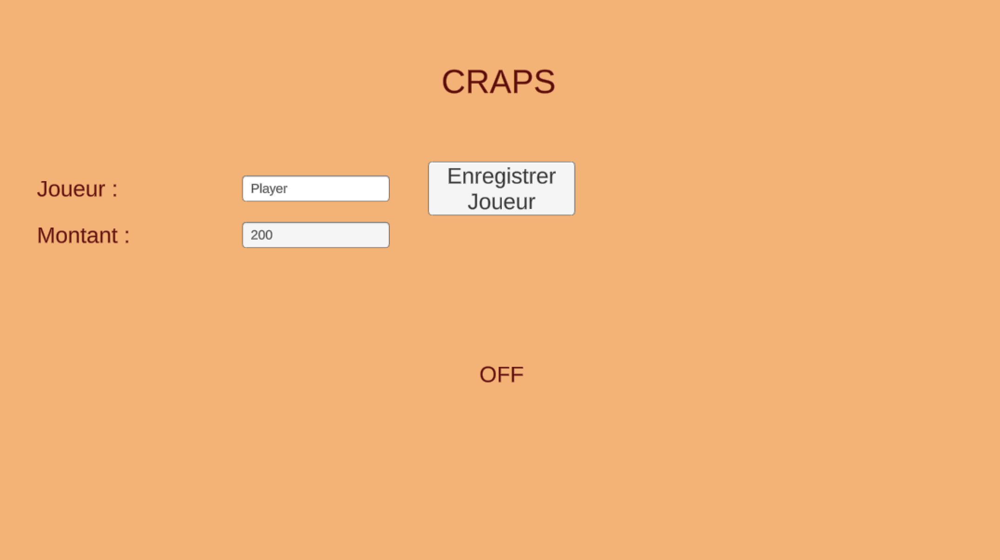
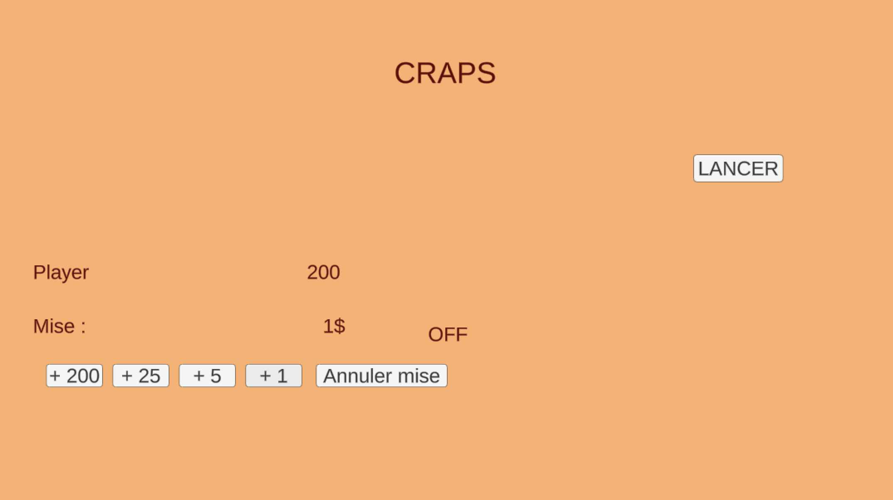
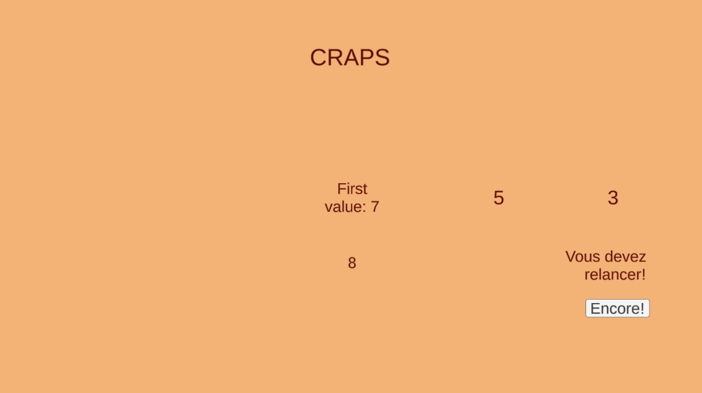
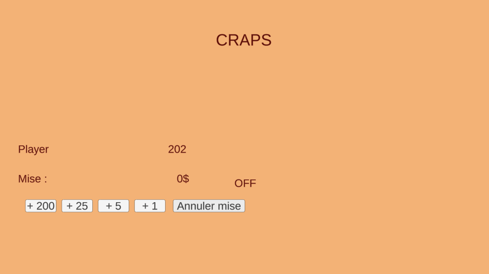
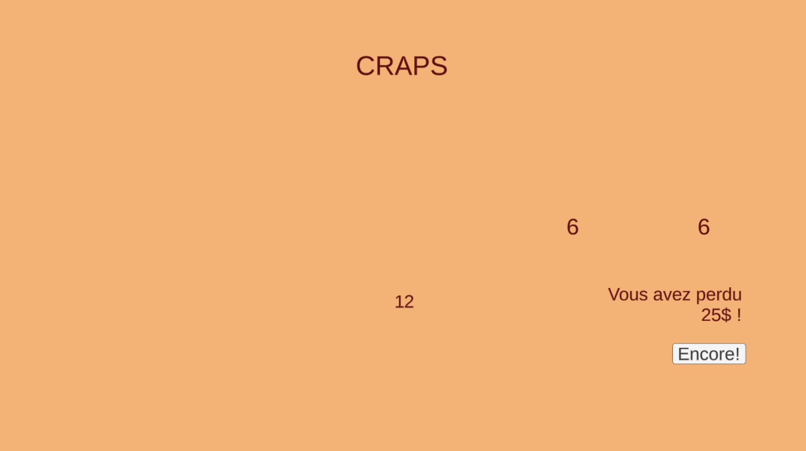
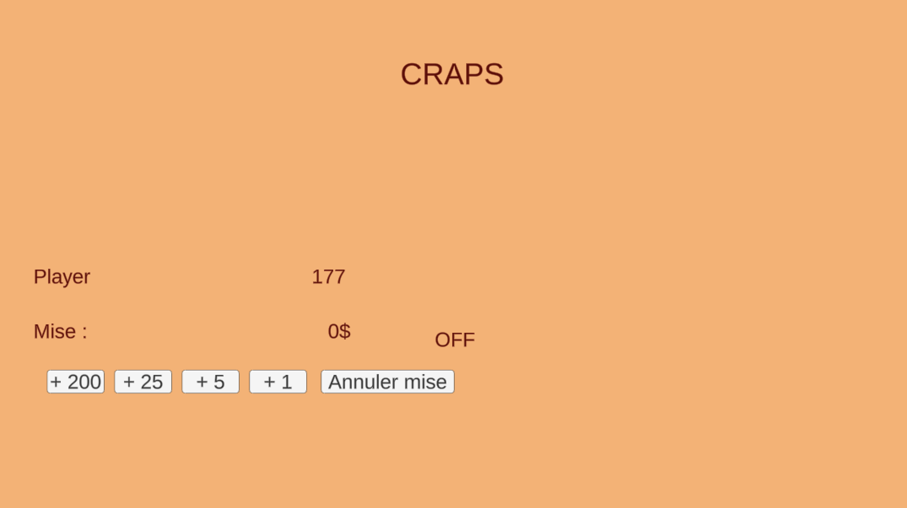

# Craps, the Casino Game

See [docs/ARCHITECTURE.md](docs/ARCHITECTURE.md) for an architecture diagram.

# 🎲 Craps Casino Game 🎰

Welcome to the **Craps Casino Game**, a simplified single-player version of the classic casino dice game **Craps**, recreated in Unity! Test your luck, place your bets, and try to grow your virtual bankroll! 💵

## 🧠 Game Objective

Your goal is to wager money on the outcome of dice rolls and try to grow your total amount. You win by making good bets and hitting lucky rolls. You lose by… well, hitting unlucky ones. 🎲

## 🧑‍💼 Player Setup

At launch, you’ll be prompted to:
- Enter your **name**
- Enter the **starting amount of money** to play with

✅ Input is validated:
- Name must not be empty
- Amount must be greater than 0

Once submitted, you’ll enter the **main game screen**.

## 💵 Betting System

- You can bet using **+1**, **+5**, **+25**, and **+200** buttons
- The **total bet** is removed from your current money when placed
- The **"Cancel"** button restores your current bet to your total money and hides the **"Roll"** button if the bet becomes 0

## 🎲 Rolling the Dice

When a bet > 0, you can click **“ROLL”** to start the round.

### ➤ First Dice Roll Outcome:

- **Win instantly** if the sum is **7 or 11**
- **Lose instantly** if the sum is **2, 3, or 12**
- Otherwise, the value becomes the **point** (displayed in the token), and you move to **subsequent rolls**

### ➤ Subsequent Rolls:

- Keep rolling until you hit either:
  - The **point value** (you **win** 💰)
  - A **7** (you **lose** 💸)

You must continue rolling until one of those two outcomes occurs.

## 🧾 Results and Feedback

After each round:
- You’ll see whether you won or lost, and the **amount gained/lost**
- Your **current money** is updated
- If you run out of money, the game ends with a light-hearted reminder about gambling 😅

## 🎯 Features

- Clean and responsive UI
- Real-time dice roll simulation using random numbers (1–6)
- Point-based play system like real craps
- Dynamic betting controls
- Error validation for input
- Visual feedback and outcome messages

## 🕹️ Controls

| Action              | Method             |
|---------------------|--------------------|
| Add to Bet          | +1, +5, +25, +200  |
| Cancel Bet          | Cancel Button      |
| Roll Dice           | Roll Button        |

## 🛠️ Built With

- **Unity 3D**
- **C#**
- Unity UI (TextMeshPro)
- Empty GameObjects for group controls

---
