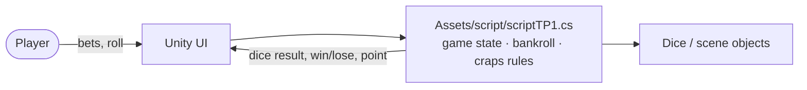

# Architecture

A single-script Unity game.

```mermaid
flowchart LR
    Player([Player]) -->|bets, roll| UI[Unity UI]
    UI --> Script["Assets/script/scriptTP1.cs<br/>game state · bankroll · craps rules"]
    Script -->|dice result, win/lose, point| UI
    Script --> Dice[Dice / scene objects]
```

`scriptTP1.cs` holds the whole game loop: bet placement, come-out roll, point phase, and bankroll updates.
